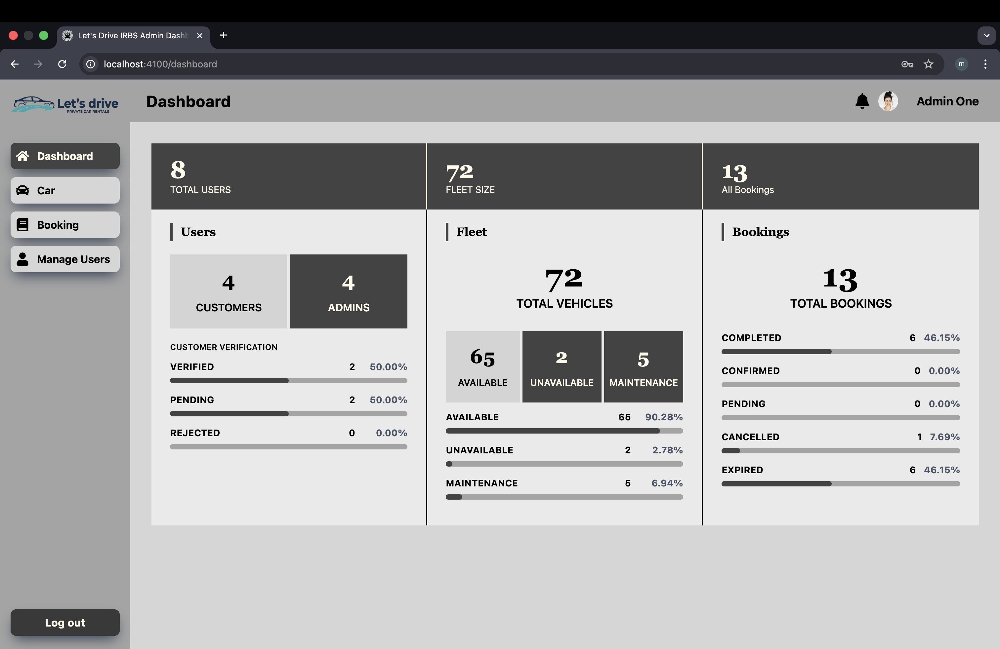
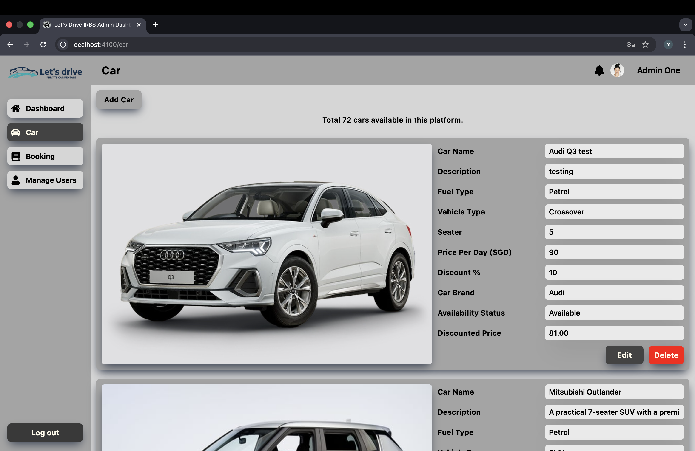
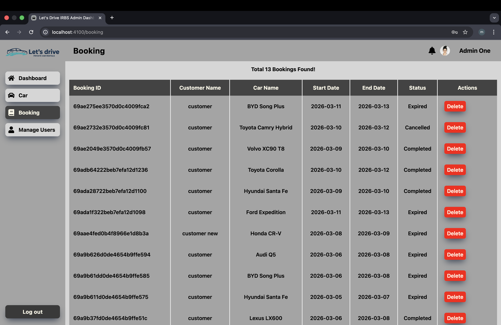
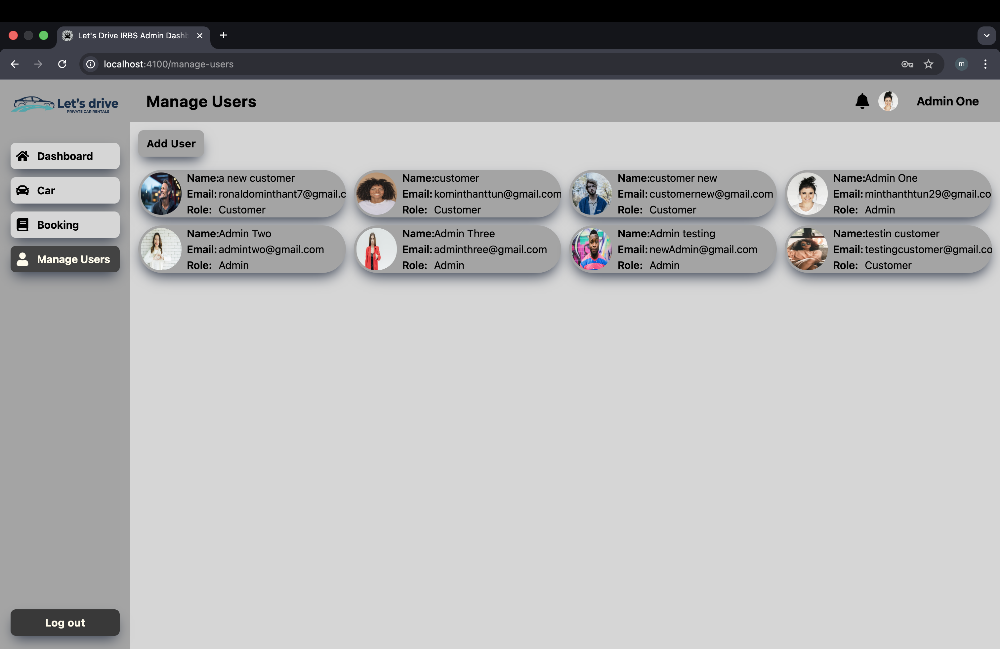

<div align="center">

# 🚗 IRBS Car Rental

### Admin Dashboard

**IRBS** (Intelligent Rental Booking System) is a full-stack car rental web application built as a **BSc Computer Science Individual Project** — designed and developed over **4 months** with a focus on real-world architecture, clean code, and production-quality user experience.

[](https://reactjs.org/)
[](https://tailwindcss.com/)
[](https://nodejs.org/)
[](https://www.mongodb.com/)
[](https://jwt.io/)

</div>

---

## 📌 Overview

This repository is the **Admin Dashboard** — the internal management interface used to oversee and control all aspects of the IRBS platform. Admins can manage the car fleet, handle booking requests, monitor users, and view business analytics — all from a single, protected interface.

It connects to the same shared RESTful backend as the Customer UI, with admin-specific endpoints protected by role-based access control.

---

## 🔗 Related Repositories

| Repo | Role | Link |
|---|---|---|
| **Customer UI** | What customers see and interact with | [my-project](https://github.com/Min-Thant794/my-project) |
| **Admin Dashboard** *(this repo)* | Internal management interface for admins | [car-rental-admin](https://github.com/Min-Thant794/car-rental-admin) |
| **Backend API** | RESTful API powering both frontends | [car-rental-backend](https://github.com/Min-Thant794/car-rental-backend) |

---

## ✨ Features

| Feature | Description |
|---|---|
| 🔐 **Admin Authentication** | Secure login with JWT — only authorised admins can access the dashboard |
| 🚘 **Car Management** | Add new cars, edit details, and remove vehicles from the fleet |
| 📅 **Booking Management** | View all bookings, approve pending requests, and cancel rentals |
| 👥 **User Management** | Browse registered customers, and block or unblock accounts |
| 📊 **Reports & Analytics** | Visualise key metrics — bookings, revenue trends, and fleet activity |

---

## 🛠️ Tech Stack

| Layer | Technology |
|---|---|
| **Framework** | React.js |
| **Styling** | Tailwind CSS |
| **Authentication** | JWT (JSON Web Tokens) |
| **HTTP Client** | Axios |
| **State Management** | React Context API |
| **Backend** | Node.js + Express *(separate repo)* |
| **Database** | MongoDB *(managed via backend)* |

---

## 🗂️ Project Structure

```
car-rental-admin/
├── public/
│   └── index.html
├── src/
│   ├── assets/           # Images and static files
│   ├── components/       # Reusable UI components (tables, modals, charts)
│   ├── pages/            # Route-level page components
│   ├── context/          # Auth and global state context
│   ├── services/         # Axios API call functions
│   ├── utils/            # Helper/utility functions
│   ├── App.jsx           # Root component & route definitions
│   └── main.jsx          # Application entry point
├── .env.example
├── package.json
└── README.md
```

---

## 🚀 Getting Started

### Prerequisites

Ensure the following are installed before proceeding:

- [Node.js](https://nodejs.org/) v18 or higher
- [npm](https://www.npmjs.com/) or [yarn](https://yarnpkg.com/)
- The [Backend API](https://github.com/Min-Thant794/car-rental-backend) running locally

### Installation

**1. Clone the repository**

```bash
git clone https://github.com/Min-Thant794/car-rental-admin.git
cd car-rental-admin
```

**2. Install dependencies**

```bash
npm install
```

**3. Configure environment variables**

Copy the example env file and fill in your values:

```bash
cp .env.example .env
```

```env
VITE_API_BASE_URL=http://localhost:8100/api/v1
```

> Make sure this URL matches the port your backend is running on.

**4. Start the development server**

```bash
npm run dev
```

Open [http://localhost:5174](http://localhost:5174) in your browser.

> **Note:** If the Customer UI is already running on port `5173`, Vite will automatically assign `5174` to this app.

---

## 🔑 Environment Variables

| Variable | Description | Example |
|---|---|---|
| `VITE_API_BASE_URL` | Base URL of the backend REST API | `http://localhost:8100/api/v1` |

---

## 🧭 Pages & Routes

| Page | Route | Description |
|---|---|---|
| Login | `/login` | Admin login — entry point to the dashboard |
| Dashboard | `/` | Overview with key stats and recent activity |
| Cars | `/cars` | View, add, edit, and delete cars in the fleet |
| Bookings | `/bookings` | View all bookings, approve or cancel requests |
| Users | `/users` | Browse registered customers, block or unblock accounts |
| Reports | `/reports` | Visualise analytics — bookings, revenue, and fleet data |

---

## 🖼️ Screenshots

**Dashboard Overview**



**Car Management**



**Booking Management**



**User Management**



---

## 🏗️ System Architecture

```
┌──────────────────────┐        ┌──────────────────────┐
│    Customer UI       │        │   Admin Dashboard    │
│  (React + Tailwind)  │        │  (React + Tailwind)  │
└────────┬─────────────┘        └────────────┬─────────┘
         │                                   │
         │              REST API             │
         └──────────────────┬────────────────┘
                            │
                  ┌─────────▼─────────┐
                  │    Backend API    │
                  │  (Node + Express) │
                  └─────────┬─────────┘
                            │
                  ┌─────────▼─────────┐
                  │      MongoDB      │
                  └───────────────────┘
```

---

## 🔒 Access Control

The Admin Dashboard is a protected application — all routes require a valid admin JWT token. Unauthenticated users are automatically redirected to the login page. Admin-specific API endpoints on the backend are also protected with role-based middleware, ensuring customers cannot access admin functionality even if they obtain a valid token.

---

## 👨‍💻 About

IRBS was built over **4 months** as a BSc Computer Science Individual Project. Rather than treating it as a standard academic exercise, the aim was to simulate a real-world development workflow — separating the system into three independent repositories, designing a proper REST API, implementing JWT authentication, and delivering a polished, responsive frontend for both customers and admins.

---

## Author

**Min Thant Tun** — [@Min-Thant794](https://github.com/Min-Thant794)

---

## 📄 License

This project was built for academic purposes. All rights reserved © Min Thant Tun.
